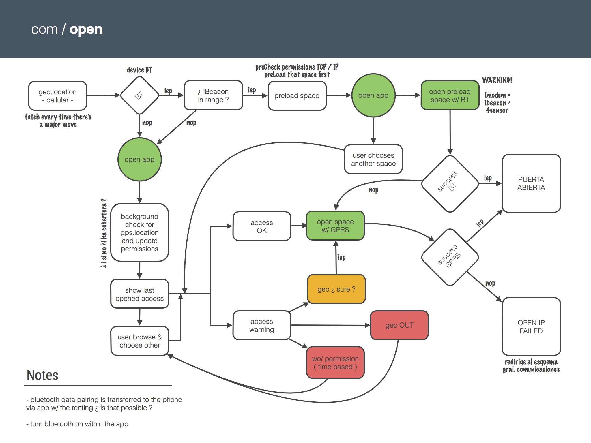

During several Meetups and panels here in Barcelona, we've been frequently asked about the hardware development at iomando. Particularly the decisions behind the technology we use to power our access systems.

Since this is a pretty telling story of how designing a product in a constrained environment can sometimes lead to a better outcome, I decided to write a few lines about the challenges we encountered during the design process building our hardware product.

## The Tech
Lets start with a rough overview of our access engine:

There are three parts to it, the mobile app, the server and the electronics next to the door.

* Mobile app: what our users download to open the door. The UI shows them the available doors, the time frame when they are accessible (according to admin permissions) and a button to open and close the door. It's like the key, but instead of being physical, it is an app.
* Server side: manages permissions and states in real time. If you were to delete permissions from a device because the phone has been stolen, the server could do that.
* Electronic device: the piece of hardware we install next to the door. Smartphones do a lot of things, but talking to doors right out of the box is not one of them, so think of this electronic board as a translator between door and smartphone.

As the main point of this post is to reveal the reasons behind our decision to use cellular technology to power our service, we will focus on the electronics installed on the door; as we mentioned before, the "translator".

There were several technologies available in the market — each one with its pros and cons, that could enable this "translation". We came out with our [first commercial prototype](/blog/2013/iomando-prologue) by the end of 2011, but is important to note that when we developed those early designs, [we still didn't fully appreciate](/blog/2013/pivoting-iomando) the potential outcome of the business.

The moment we faced the blank canvas we had four candidates[^1] on the table: GSM (cellular)[^2], Wi-Fi, Bluetooth (not 4.0) and NFC. We prototyped each of them, and spent a lot of time trying to understand which one would be the perfect fit to our business model.

Finally, we opted for GSM; below are the reasons why.

### Compatibility
Lets start with NFC: back in 2012 the introduction of NFC was seen as a major disruption when it came to interact with the real world (update from the future: wrong!). Of course NFC would be a great way to check-in with iomando, but presented three issues that rule it out from the beginning:

* Compatibility: only Android was officially supporting NFC. Since the 39% of our user base[^3] run on iPhone, leaving more than one third of our customers out didn't look like a smart move[^4].
* Car access: iomando started its operations in communal parkings and by definition the user remained inside a car during the whole interaction. In such environment one can easily see how NFC forces to reach out to some element that is installed outside the car. It sounded like something we wanted to avoid.
* Additional equipment: even though the experience of waving something outside the car was crappy, the idea of having to equip each parking with a clunky reader implied more costs and a difficult installation.

GSM seemed like a better option basically because it was rooted in the nature of smartphones. Sending and receiving packages over TCP/IP is the thing they do best. Moreover, if we talk about compatibility, GSM is compatible with all devices out of the box, without the need of explicitly toggling an additional connection.

Believe it or not, one of the most shocking takeaways we brought home from our user research was the amount of people that still turned off Wi-Fi and Bluetooth because "it drains my battery". Since GSM was working out of the box for everyone, it turned out to be a more natural fit for our user behavior.

### Installation
As we mentioned on the [product announcement](/blog/2013/iomando-10), iomando needs to be installed by an authorized technician. If you are familiar with the logic board that controls a garage door, you know how crazy those things can get.

For this reason, beyond having a great product for our end user, we also wanted to provide a great experience for the professional installing the device. After all he is our user, too.

To keep our installers "happy" we needed a product that was both easy to install and also kept the installation process the same no matter the external circumstances. In other words, the environment should not place any constraint to the installation process.

That immediately ruled out the Wi-Fi option — at least running in infrastructure mode[^5], because most of the time there's not a reliable Wi-Fi connection available to feed the device. The versatility of our product (we can install in places ranging from small houses to big corporate buildings and public facilities) would lead to two problems if it was running on Wi-Fi:

* Most of the time you just don't have a Wi-Fi network available in the middle of the street or in an industrial environment.
* On the occasions you have a network in range, in a community for example, neighbors don't want to "lend" their own network for the sake of the service.

And if that was not enough, this also led to more related issues.

When there was a connection and the user would agree to use it, in a private house for example, there's no easy way for the installer (who might know nothing about routing) to properly set the DCHP or configure the system to point to a particular IP.

Even more important, reliability. On such environment there's no way we can grant the QoS if the connection doesn't depend on us. If iomando is providing the service, the fewer intermediate dependencies we can't control, the better.

Here is where GSM stands out the most, because it works out of the box.

The installer just needs to grant power to the device and connect it to the door. The GSM connection automatically registers the device to our platform and assigns it to the administrator. The only thing the admin has to do is log in to our online panel and start granting permissions to the end users.

### Pairing
From the installer perspective a GSM enabled module made a lot of sense, but it also had to appeal to the end user. Here is where the concept of pairing comes into play.

Pairing a phone with another device has always been (at least before the introduction of Wi-Fi Direct and BT 4.0) a painful experience. We built some prototypes with Bluetooth and Wi-Fi, and we also tried some of our competitors products, but it was a nightmare when it came to pair the device with the smartphone.

That made us think deeply of the problem we were trying to solve and the interaction that made it possible.

Opening the door with a smartphone was not a lengthy action: launch the app and tap open. Old keys and remotes are not great products, but they are fast as hell. If we wanted to appeal to our customers we needed to, at least, match that speed.

Bluetooth technologies are great for long term relations, like a headset for streaming music, where the main experience is way longer than the pairing itself. In our case, the procedure was quite the opposite. You wanted the pairing to be fast, almost non-existing, because the shorter the experience, the better.

That was not possible with Bluetooth.

Each time you wanted to access you had to wait for the device to pair, even in some places where the entry point was far from the device, there were problems with the range of the network… It was not a great solution for the kind of experience we were envisioning.

Moreover, imagine the first time pairing, the on boarding process. Picture a public facility where thousands of people have access — we've got plenty of those. The people would have to go next to the device in order to pair their phone, as some kind of pilgrimage. Bluetooth doesn't scale well beyond a reduced particular use.

From a pairing perspective, we went with GSM because there are several advantages using this technology:

* Pairing is done server side: there's never a direct communication between the smartphone and the device. That allowed us to manage and push the permissions at scale and in real time. Users didn't need to pair anything because is the server that grants the permissions in a transparent and automatic process for the user. The moment the app is downloaded, the user already has a button to open the door, given the admin has already granted the permission, with no action required on her side.
* Opening the door is way faster, between one and two seconds after the button is pushed. Since the connection is a TCP/IP request to the device, the time it takes to open the door is no longer than sending a WhatsApp to your colleague.

Again, mobile is at its best when transmitting data packages over cellular connections, so leverage that to build our platform was a no brainer.

### Security
This one is tricky, because it is difficult to evaluate security in absolute terms. You can assert one thing is more secure than other, but "how secure is it in an absolute scale" might not have a direct or easy answer.

One of the great weaknesses of old systems, like remote controls, is that they offer poor security.

Because there is a local element you can interact with, finding a security breach becomes a matter of time. With the GSM connection we removed the direct link between smartphone and device, all the traffic was routed from the server.

### Yet, more reasons
Real time: this is one of our costumers most valued features. It lets our users know when the door has been opened (even with systems other than iomando). Real time also fashions itself as a security feature, because permissions are updated instantaneously, so if an administrator has to grant or block access to anybody, changes occur immediately.

Remote open: as we said before, there's no direct connection between the smartphone and the device. This unlinks the physical constrain when it comes to open, so one of the indirect benefits is that doors can be opened remotely.

Looking back, using GSM connections in our devices was one of the best decisions we've ever made, and it gave us a huge competitive advantage from the product perspective.

It is true that the nature of a centralized GSM connection [shaped our business](/blog/2013/services-and-subscriptions) in a way that some customers didn't expect, but at the end, it allowed us to design an easy installation process and creating a frictionless on boarding experience from the user perspective.

---
[^1]: There were actually more, but these four were the ones we were seriously considering. There were already products in the market that opened doors with missed calls and other crazy ideas. We spent a lot of time looking into them and tried to figure out the competitive edge each could bring to our business model. As a rule of thumb, we understood our service was standing in the shoulders of giants by means of running on smartphones, so anything that wasn't pointing on this direction wasn't even worth considering.

[^2]: The communication layer was not running explicitly over the GSM protocol. Cellular might sound like a more accurate description, but for the sake of simplicity I'll refer to GSM / GPRS / UMTS / LTE as cellular or GSM indistinctly.

[^3]: Data from November 2013, but it has remained more or less the same since.

[^4]: Update from 2014: iPhone 6 added an NFC chip, but it was only for Apple to use, so no API, no developers, yet.

[^5]: The Wi-Fi version could come in three flavors: Access Point, Infrastructure or Ad-Hoc. The Access Point, creates an SSID on its own, that's great, but we found out that in some places the network could interfere with the one you already had installed. The Infrastructure mode was useful if you already had a Wi-Fi in your place, but that was not the case in communities. And of course, dealing with DHCP was a mess. Finally, the Ad-Hoc connection is great for this kind of application, but the Wi-Fi direct protocol was not mature back then and there was poor support for it.