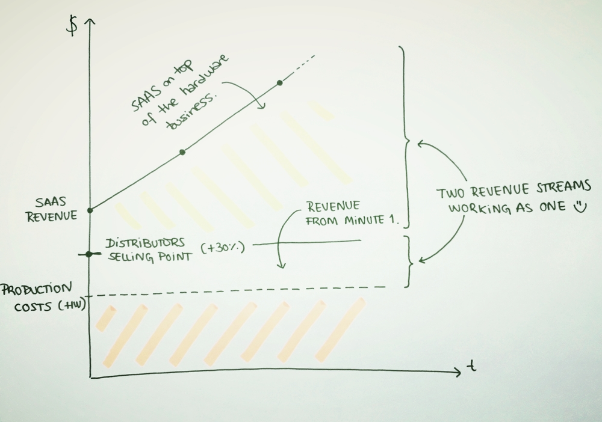

When we [launched iomando](/blog/2013/iomando-10) we did it with a clear goal in mind: to provide the best keyless access system for our customers. In order to do this, we focused on having a [great product](/blog/2013/betting-on-cellular), but also worked hard to emphasize the experience surrounding its core product.

To that end, we [kept on building](/blog/2013/iomando-11) a strong and trustworthy installation network and a new approach to the way our customers [paid for the service](/blog/2013/services-and-subscriptions).

So far we have gathered a ton of feedback from our distribution partners and customers, and now we are in a position to acknowledge it.

> We were wrong about our pricing strategy

We weren't wrong though in a way that our pricing *made no sense*. On paper it made all the sense in the world, everybody won on paper: the customer, the distributor, the installer and us. But as it turns out when you put all the pieces together and understand how it all plays out, you realize the whole model breaks down.

We are here to explain what we've learned, why we were wrong and what we've done to fix it.

## Our Assumptions
Despite we wanted to blur the lines between them, we clearly run two separate business units that are built independently but work together shaping the whole iomando experience.

On one side we have a hardware device we install next to the door in order to manage and control it. On the other, we have the software side, the mobile app.

This distinction matters because those are diametrically opposed business models that we tried to bundle together in order to facilitate the understanding of the overall product. We had our reasons to do that, but to be fair (this was our fault, too) we got a little scared by our investors and advisors: they were deeply concerned about the scalability of the hardware side, therefore they "encouraged" us to hide it as much as we could.

As you can see above 👆 our combined selling price for the first year was lower than the acquisition cost for a given user. We aimed for a small subscription to attract more customers in order to hit an early critical mass of users that would, eventually, drive better unit economics to the business.

Because of that, we thought that the service would be more attractive if we sold the idea of *"access experience"* instead of *"a piece of hardware attached to your door"*.

The idea of paying for an action sounded like more goal-oriented than paying for a piece of electronics and a piece of software.

So we tied all together and treated everything as a SAAS packaged, that was billed annually to the customer. This way the hardware was "rented" to the customer for the time they had contracted the service. If for any reason, the customer wanted to stop using the product we can still get the hardware back and re-use it in another place as long as it was in good condition.

In a nutshell, this is why we thought that was a good idea.

* The customer perceived us as a service, not a product that she had to buy.
* We detached the installation from the customer — thus a better experience and an authorized partner from our network would handle it.
* We had absolute control over the hardware since it was "rented" to the customer.
* Every customer would run on the latest version of the hardware as well, if a new version comes out, we replace it at no additional cost.
* The last one implies less complexity and fragmentation across the platform, therefore, money and complexity being saved on development.

## What Really Happened
We faced two major problems. The first and most important was that our deals with installers and distributors weren't closing as fast as we expected. The second was that a lot of customers had a hard time understanding our proposition and they didn't fully understand what they were paying for.

The first problem was worrisome because this network was the fuel that propelled our growth among small and mid-sized customers. We couldn't afford a sales team to chase this kind of customers, because they were extremely granulated.

We wanted to establish a revenue-share with those distributors and keep sharing it every year the customer was enrolled with the service. We assumed this model would incentivize the distributor to close as many deals as he could and would also keep the customer happy as long as they were paying.

It didn't work.

It didn't work because we assumed our business would develop in a vacuum where we were the only players. We couldn't be more wrong. The truth was that our service interacted with other players that were already in place and that created some unresolvable tensions.

As it happened, distributors already had a business: we were naive enough to go to the distributor thinking that they will immediately embrace our service. We designed the revenue model with the assumption that they would be fully (and only) devoted to our product.

But distributors were used to *business as usual* model. That meant "I buy at `x`, then I sell at `x+margin`" the classic markup approach. Our SaaS model meant that the first year we might lose money on a single customer, the markup in absolute terms meant little money.

Distributors don't want a long-term relationship with someone they never heard of (and that makes sense). For them, it would be like marrying the first person you just saw across the street.

We designed our strategy as if we were to be around for the next 25 years. We were confident that would be the case, but others outside the company were surely not.

In short, we thought we were going to *improve* their business with an absolutely new way of doing things from a company that was created a few months ago. You put it like this and wonder how we even tried with such strategy in the first place.

## How We Fixed It
The strategy wasn't working. Distributors passed because we didn't fit into their mental model and that was blocking our way to small customers and therefore, our ability to grow and scale.

After hundreds of wiped boards and meetings with distributors, we came up with a clever approach that brought together the best of both worlds.

We've explicitly separated our business units, both hardware, and software.

Now, we directly sell our hardware to distributors. It has a price and they sell it to the customers with a markup and an installation cost. No more "renting". The customer buys the hardware and owns it. Therefore, on this side, we drive a classic ~30% markup business that is paid up front and finances almost all the manufacturing costs and operations. Prior to that, the cost of the hardware was bundled onto the subscription and we were "losing money" on every single sale, hoping the LTV of the customer would account for that in the future.

> This makes the distributors happy because they can run a business, as usual, their margins are higher in absolute terms and the customer acquires something and it feels like she is [paying for atoms, not bits](/blog/2014/plastic-bits).

On top of that, with every sale distributors closes, we tie the customer back with a SAAS that provides the access control features. We make it everything plug and play and transparent to both the installer and the customer. The moment the installation takes place, our device connects to the internet and awaits to be activated by the customer. She only has to go to our activation portal, introduce the serial number and the number of licenses and it is already working.

> This makes customers happy because the fee is lower (we can afford that because we have plenty of margins here since the solution runs entirely on software) and the setup is really easy.

But it also makes us happier than anybody because we transformed a SAAS model, into a double-edged business with an up-front revenue from the hardware that provides a stream of money to sustain manufacturing expenses, and a SAAS revenue from the software that brings scale and long-term profits.