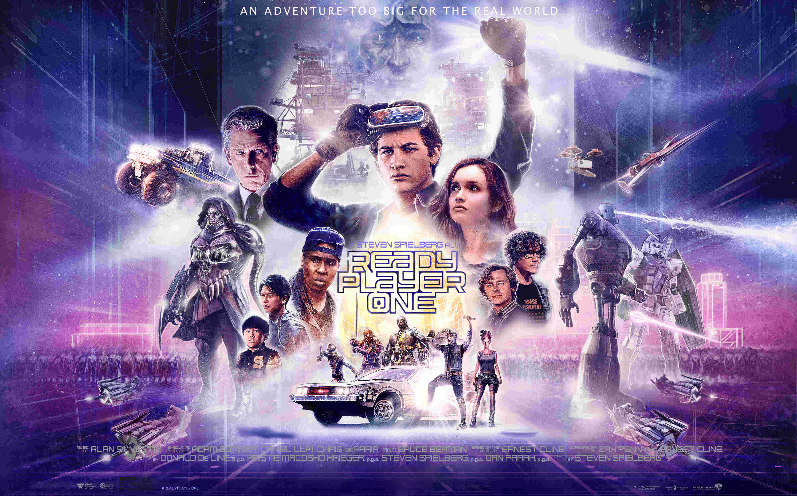

Last month I went to the movies.

This is kind of an extraordinary event by itself because I never go. Turns out a wise friend extended the recommendation, told me the movie was worth it, and as I always do, I trusted his advice.

I knew nothing about the movie until I found myself staring at the backlit billboard, next to the cinema's front door. It read "[Ready Player One](https://www.imdb.com/title/tt1677720/)", never heard about it, but truth be told, the artwork looked really cool — something I could enjoy, I thought.

Long story short, I loved it; good thing I trusted my friend, as I always do.

I'm not here to talk about how much I liked the movie though, but the follow-up conversations I've been having with several people about its underlying message. The last one, just a few minutes ago, and actually the spark that led me to start typing these very lines in the first place.

The widely shared opinion I keep hearing about RPO is that the movie belongs to the science fiction realm; that it is a good thought experiment for something that will (most certainly) never happen — or it will far, far, far away in the future.

In other words: "it is just a movie".

I felt kind of lonely on the other side of this argument because I strongly disagree.

I'd argue we are already living in the early stages of this "dystopian" reality. Nowadays, as a society we are building (with an astonishing amount of success) parallel, digital worlds — say games or social networks, for people to ~~lose~~ immerse themselves into. The results of this massive societal experiment speak for themselves, anywhere you go or look.

Despite our current means to recreate these experiences are still flat, bi-dimensional, backlit matrixes of colorful dots (aka. screens), just pay close attention at how these devices, still far from rendering an accurate picture of reality, are already captivating human attention.

Look no further: during my commute, despite the multitudes, I can still count the number of people I see with their heads up. Although if you want to experience this phenomenon in its full extent, watch out for younger generations, the truly digital natives; they're the ones that grew up with an iPad attached to their fingertips: they live in there.

Don't get me wrong, I am in love and deeply fascinated with technology, but our current gadgets pale next to the ideas envisioned at RPO. Our state of the art smartphones is still far away from rendering fully immersive experiences.

Precisely for this reason I am convinced this future is inevitable. If given the current state of our technological development, we are already attached in ways we could never foresee fifteen years ago, imagine how it will all look like with mainstream availability of devices capable of recreating RPO.

I don't think this last point can be even argued, but this is just one side of the problem. The true, underlying narrative I see around this whole "parallel world" debate is not technological, but societal.

The question we should be asking is not "if" we'll eventually be capable of developing a digital world virtually indistinguishable from ours. Not even "when". This is inevitable and we all should acknowledge it is going to happen, sooner or later, period.

The question we should be asking, the one this movie is subtlety exposing, is at which point it will become cheaper to recreate an entirely new (digital) world rather than fixing the one we live in.

Just food for thought 🤔