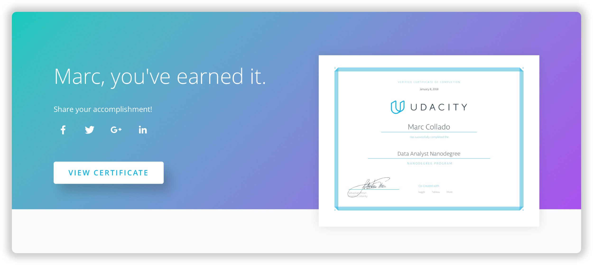

Last January I proudly finished the [Udacity Data Analyst Nanodegree](https://www.udacity.com/course/data-analyst-nanodegree--nd002) (DAND) and this is my attempt — I hope in 1.000 words or less, to publish the kind of post I wish I'd read back before I enrolled: relate why I did it, who is it for and, of course, how the experience was like.

## Why I Did It?
Despite Udacity's Nanodegree programs certainly claim to [employ their students](https://www.udacity.com/success)[^1] in the most cutting-edge, on-demand jobs, the main reason I joined the program was to level up my (data) game in my current job as a Product Manager at Ironhack, not to start a new career as a data analyst.

More often than not, I found myself dealing with situations involving data flows I didn't fully comprehend. The idea of making decisions without a solid data-driven foundation backing it up made me sometimes feel uncomfortable about the path I was leading my team towards. Product meeting after meeting, I had this nagging thought of knowing that there was something missing all the time, that we were not getting the whole picture because of our data ignorance, but still, couldn't see it.

Let me be crystal clear here before we move on: by *"data"* I'm not referring to the *"big data"* everybody is talking about as if it was teenager sex. Believe me, very few people deal with truly *"big"* data. The DAND is also not about *"big data"*, but neither *"big data"* was what I was looking for. On the contrary, I wanted to address rather smaller things: statistically inclined issues, biases or widely opinionated meetings that were clouding our decisions and ultimately setting the stage up for a HiPPO driven environment.

After an unreasonable amount of research — let's save this for another post, and factoring in my time constraints, a random Wednesday of April I decided to enroll. It was my first attempt to commit to an online program this big, and I must admit, for better or worse, back then I didn't fully understand what I was signing up for.

In a nutshell, I didn't aim to become a fully fledged data analyst — despite Udacity claimed you could if that was your goal. I just wanted to bring the data skills to my current job, hoping they'll help me with these:

* Ensure our product team was accurately using and making the most out of our data
* Set up an environment led by healthy and meaningful metrics
* Back and make decisions supported by data as an anchor of an agreement, kind of a source of truth for our team
* Leave behind this wild guessing mode we were living in and start doing things right :)

## The Program
The whole curriculum was broken down into eight modules (seven-plus introduction)[^2], requiring a dedicated project delivered by the end of each one. Each project came with its own submission process — which they don't take lightly, where a Udacity reviewer inspects and grades your work until it meets the rubric's criteria.

It goes without saying that in order to graduate you must submit and get all your projects approved by the reviewers.

Despite the program structure has changed a little bit since it shifted to a term based structure, the topics it covers still remain mostly the same:

* Statistics: both descriptive and inferential
* [Exploratory data analysis](https://github.com/MarcCollado/wine)
* [Data wrangling](https://github.com/MarcCollado/open-street-map)
* [Machine learning](https://github.com/MarcCollado/enron)[^3]
* [Data visualization](https://public.tableau.com/profile/marccollado#!/vizhome/TitanicFinal_6/Titanic)

On top of that, each module and project builds on top of different technologies: [R](https://www.r-project.org/) and [Python](https://www.python.org/) for data analysis and statistics, [Numpy](http://www.numpy.org/) and [Pandas](https://pandas.pydata.org/) for data wrangling, [Scikit Python library](http://scikit-learn.org/stable/) for machine learning and of course, [Tableau](https://www.tableau.com/) for data visualization. And if it was not enough, certain modules also brought in additional libraries, which made the tech toolkit even more fun — and complex.

The amount of topics and technologies covered during the program is massive. You definitely walk out of the program with a solid understanding of both the fundamental concepts behind the data analysis and the tools a "real" data analyst will encounter in her daily routine.

This a great approach for the program if its ultimate goal is to put their students in a job ready position with the least amount of time. In my particular case though, I felt the program was a little bit too broad, especially judging by the number of "supporting tools" you have to learn from scratch lesson after lesson.

Let me explain: while learning this wide range of technologies (R, Python, Tableau…) is definitely an enriching experience for the mind, it also dilutes the value of the learning outcomes by changing the underlying technology all the time.

If I were to design the program around my personal outcomes, I'd have bet for a single technology, say Python, and build all the curriculum on top of that. The benefits of this approach would have been twofold. First, the students would have achieved a higher level of "code mastery" in said technology, which would have enabled them to build stuff quicker and with more ease, even after the program. Second, by not changing the underlying technology, the program would have been able to focus more on the content itself and go deeper at every stage, letting the technology fade away in the background.

Months after graduating, back to my job — and not working as a pure data analyst, I often find myself scripting some code with Python and building small helpers to automate some nasty, undesirable groundwork. But I've to admit that I've never touched RStudio, Tableau or Jupyter Notebooks ever since. I'm grateful to be aware they exist, but maybe I could have leveraged that time to go even deeper with Python.

But again, that's just a personal opinion based solely on my own experience. And don't get me wrong, the program design is superb, but maybe I was probably expecting something the course was not intended for.

## The Experience
Finally, how is it like to go through the program? I won't lie: it is hard. Although the course structure is extremely clear, the materials are first class and all the projects really engaging, still, setting aside the time to [work on your own](/blog/2017/alignment), without [social pressures](/blog/2017/community) of any kind, remains the most challenging endeavor, even for Udacity.

I finished the program in eight months[^4], but I was not consistent with my schedule and the number of hours per week I was investing, which I believe is the ultimate "hack" to stay on the program's track.

The main problem I faced would go like this: the amount of effort it takes to re-engage again with the course is (exponentially) related to the amount of time you spend away from it. In other words, the more time you stay away from the program, the more difficult it gets to just go past the Udacity's login screen. It becomes an [ongoing battle](/blog/2018/book-war-art) against your willpower.

I suffered from that, big time. I remember sometime around June where after over a month without completing a single lesson, the thought of dropping out even crossed my mind. I endured, but the chances of not writing this post right now were then higher than you might expect.

On the other hand, I also remember periods where I literally opted out of life and did nothing but Nanodegree. I was pretty unreliable with my efforts and, as far as I can tell, getting this right is something that will totally ease your way into the program.

Besides the [disconnection from the social experience](/blog/2017/alignment), which I definitely believe is the most pressing challenge online courses must solve for, the course was really good and definitely delivered on its expectations. The materials were well crafted, the projects had a clear purpose and the support you receive from Udacity is extraordinary at each step of the way.

So, upon graduation, if you were to ask me: would you do it again? I'd say *"absolutely yes"* if you are looking for a career move to a data related role. The DAND is the perfect bridge to land an entry-level job in-field or even as a prep stage before joining an immersive, full-time data science bootcamp.

But as a "[career booster](/blog/2016/hybrid-profile)" maybe I should have explored other softer options that would have allowed me to customize a little bit more my journey. As a counter to that, I'd also argue that it is easier to see this pattern looking backward, now that I've already explored the data analyst path. A hypothesis I couldn't have articulated back when I started, because my depth of knowledge on the matter was way narrower.

Well, no matter what, beyond the program specs, overall I'm extremely happy I enrolled (and graduated) the DAND. Because it has not only helped me out at my job the way I expected and planned for from the beginning. It has, unexpectedly, also proved to be an invaluable resource for everyday life and has transformed the way I perceive, through the data lens, even the smaller situations and decisions.

---
[^1]: When I enrolled back in April most Udacity programs were paid on a monthly basis and offered a 50% money back guarantee if you graduated in less than a year. On top of that, there were two payment options, the "basic" for $199/month and the "plus" for $299/month. Only the latter offered (subject to certain fine print) "jobs guarantee" and I quote from their marketing copy: *"While all of our Nanodegree programs are built with your career success in mind, you must enroll in our Nanodegree Plus program to secure a jobs guarantee.* Since then, most of their programs have been gradually migrating to a term-based structure and their approach to "job assistance", that's just an opinion, has become less aggressive and looser.

[^2]: The DAND program structure was upgraded two times during my enrollment. The first one, in September, was a small tweak to the curriculum structure, which I opted in. The second, in December, was a major change where they moved the whole program to a term based structure — mainly in line with the rest of their new Nanodegrees. Udacity kindly offered me to upgrade to the new one, but I personally stuck to the old model since I was about to finish anyway.

[^3]: Machine learning is no longer available in the new curriculum, all the contents have been moved to [its own Nanodegree program](https://eu.udacity.com/course/machine-learning-engineer-nanodegree--nd009).

[^4]: Ideally you're expected to finish in six months, but you got half the money back if you did it in less than twelve. Now the program has shifted to a term model though, the option to get your money back if you were to finish under a certain time frame is no longer available.